# Troubleshooting and Data Management Documentation

This README contains a series of questions and answers related to troubleshooting data issues, creating reports, and managing data pipelines. Below, you'll find the details of each question along with the corresponding answer. This will serve as a guide to understand the troubleshooting process and address common data-related challenges.

---

## Task 1: Data Modeling & ETL

### 1. Database Setup

Imagine you’re building a dashboard to track orders, customers, and inventory for a food
delivery business.
Create a simplified schema that includes the following tables:
- `Customers`: customer_id, name, registration_date, and region.
- `Orders`: order_id, customer_id, order_date, total_amount.
- `Items`: item_id, item_name, item_price, and inventory_stock.
- `Order_Items`: order_id, item_id, quantity.

### Deliverable
- Provide SQL code for creating these tables.
- Write a short paragraph explaining your rationale for the structure

**Answer:**

The database design is straightforward and simple, with normalization applied to eliminate data redundancy. Primary keys have been assigned to each table to uniquely identify records and ensure data integrity. This design helps maintain data consistency and reduces redundancy across the database. One potential improvement would be to assign a surrogate primary key to the order_items table. By doing so, we could eliminate the need for a composite key (which currently uses order_id and item_id), improving query performance and making the database easier to maintain over time.
To make future troubleshooting easier, I’d create a checklist of potential issues. This would help me quickly diagnose similar problems down the road and ensure that troubleshooting steps are well-documented for consistency.

I started by creating a postgresql database using AWS RDS for hosting.

The SQL code for table creation is shown below:

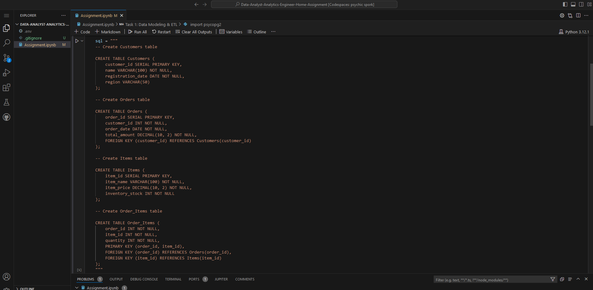

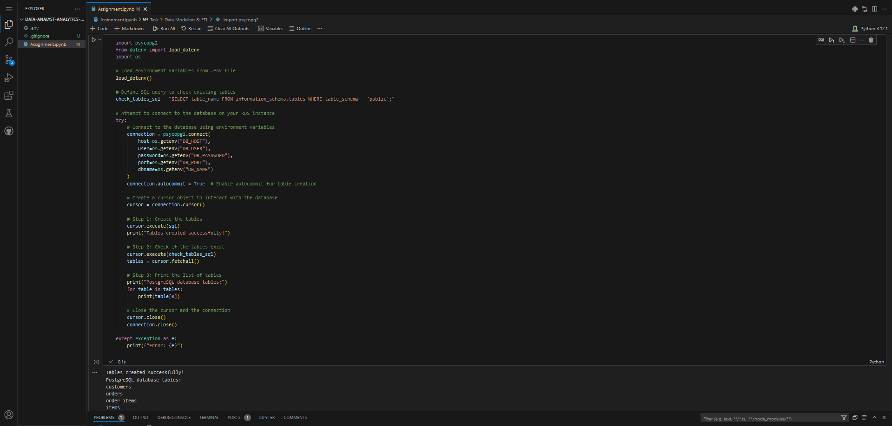

Then, I wanted a visualization of the database, so I logged into pgAdmin 4 to obtain the following image: 

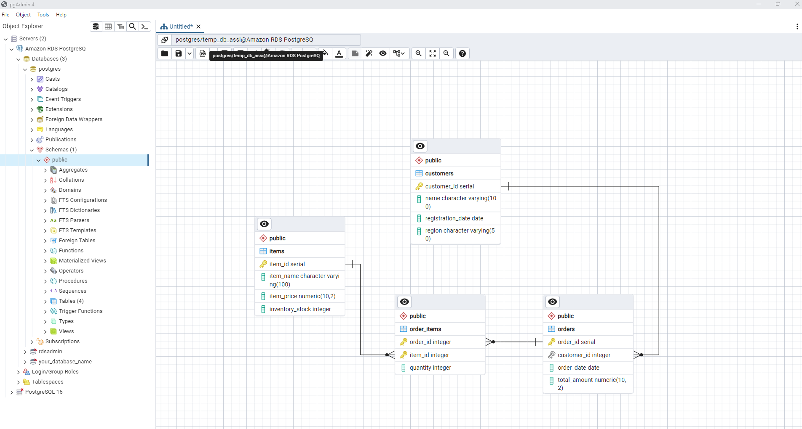

Finally, I loaded data into it using the faker python library:

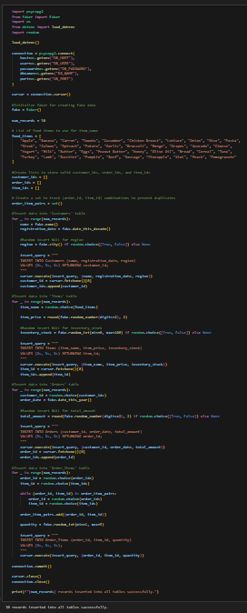

---

### 2. ETL Process

Assume you’re receiving daily files with new orders and customer updates. Write a Python
script that would:
- Load new data from a CSV file into a staging table.
- Update the main tables (`Customers`, `Orders`, `Order_Items`) based on this new data.

### Deliverable
- Python code demonstrating the ETL process.
- Brief explanation of your approach to handling updates, deletions, and new entries.

**Answer:**

The script below loads a CSV file into a staging area using a single line of code with the pandas library:

df = pd.read_csv(file_path)

This converts the CSV data into a DataFrame, which is more suitable for efficient data processing and manipulation. The subsequent data processing steps, including extracting relevant columns and inserting data into the database, are fully automated using Python.

Given that the CSV file size is expected to be manageable (less than a few GB), this approach leverages pandas DataFrames to efficiently process the data without the overhead of executing multiple SQL queries. By processing the data entirely in-memory, the script avoids the latency introduced by querying the database multiple times, making it a more efficient solution for moderately sized datasets.

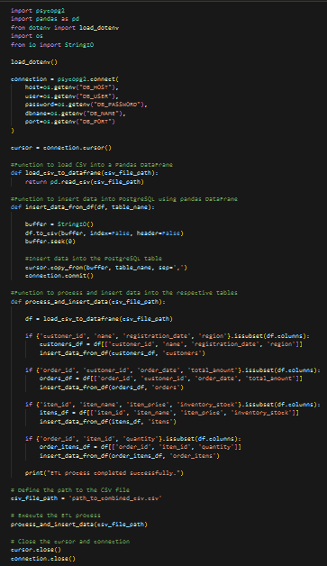

---

## Task 2: Data Analysis and Dashboarding

### 1. KPIs and Metrics

Based on the schema from Task 1, calculate the following metrics:
- Daily Total Revenue: Total amount of orders per day.
- Average Order Value (AOV): Average order amount over the last 30 days.
- Monthly Active Customers: Count of unique customers who placed an order within the last
30 days.
- Top Selling Items: The 5 most ordered items in the last 30 days.

### Deliverable
- SQL queries for each metric.
- Short explanation of each metric’s relevance to the business.

**Answer:**

-Daily Total Revenue
For this task, I chose to use SQL queries instead of fetching all the data and using Pandas for the EDA process. If the database were larger, storing the entire dataset in a Pandas DataFrame wouldn't be feasible. While Pandas might be more suitable for a small database like this example, I opted for a more practical approach, using SQL queries for each metric.

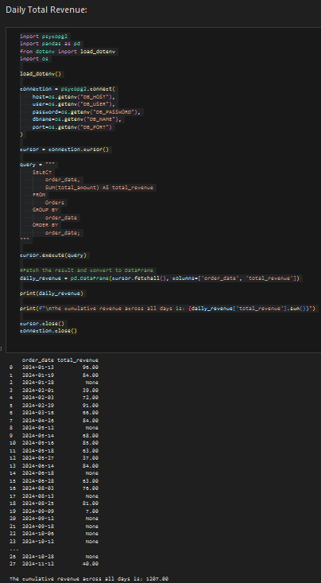

-Average Order Value
This took me a few extra queries to visualize the data. Once I realized that the total_amount column couldn't be used due to many NaN values, I decided to apply some feature engineering and use a combination of columns (quantity + item_price) instead.

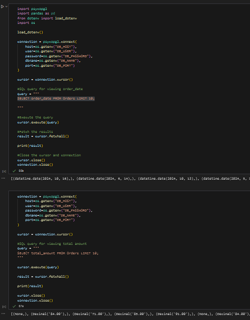
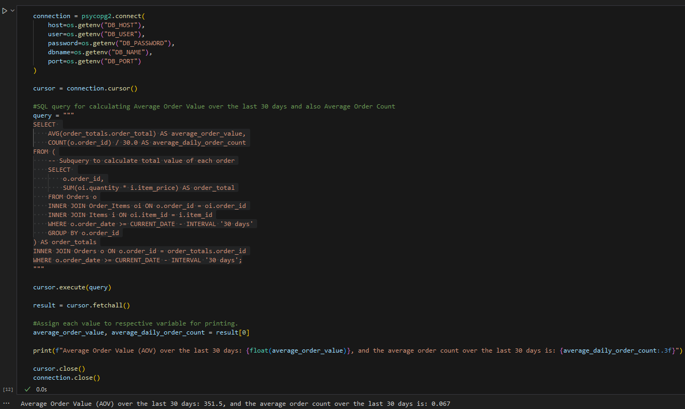

-Monthly Active Customers
This could be achieved by using count distinct on the customer_id and a where clause for the last 30 days interval.

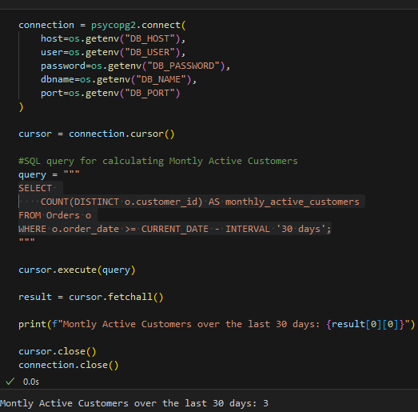

-Top Selling Items
It seems that even by having several item names in my database, only 3 popped up for being ordered in the last 30 days. The sql query for this uses 2 inner joins to access the date from the orders table, quantity from the order_items table and item_name from the items table. The results are then converted into a pandas dataframe for better visualization of the table. 

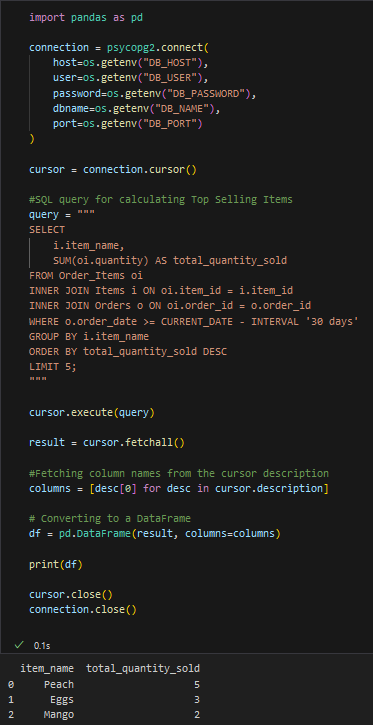

---

### 2. Dashboard Creation

Using AWS QuickSight (or any other dashboard tool), create a dashboard that visualizes the
metrics above. Ensure your visuals are clear and informative for stakeholders to understand
business performance.

### Deliverable
- Screenshots or a link to the dashboard.
- Explanation of the dashboard design, why you chose the visualizations, and how it helps in
decision-making.

**Answer**

For the dashboard, I chose different types of visuals to make the data easy to digest for stakeholders:

- Top Selling Items (Pie Chart): I used a pie chart to show which items are selling the most. It makes it simple to see at a glance the share of each item in total sales.
  
- Daily Revenue (Bar Chart): A bar chart was chosen for daily revenue to visualize how sales are changing over time.

- Indicators: I kept some key metrics like total sales and average order size as indicators, so stakeholders can quickly get an overview of performance.

This approach makes it easier to spot trends and key insights quickly, helping with informed decision-making.

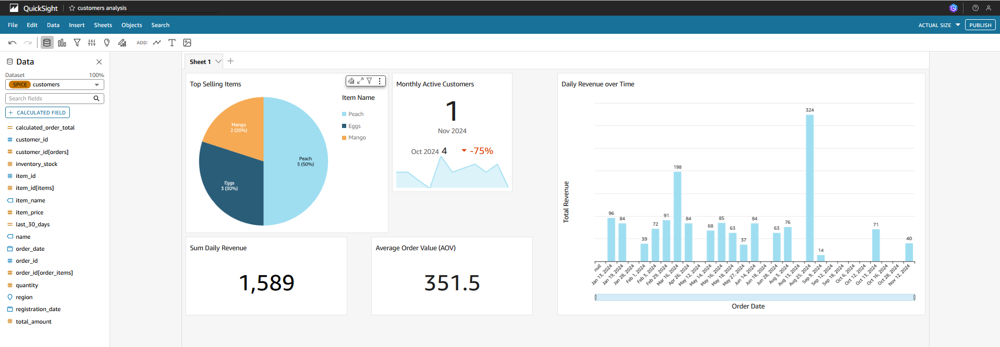

---

## Task 3: Data Quality and Troubleshooting

### 1. Data Quality Checks

Implement SQL queries to perform the following data quality checks:
- Check for any `NULL` values in critical columns (e.g., `order_id`, `customer_id`,
`total_amount`).
- Identify orders with unusually high or low `total_amount` values.
- Ensure all `order_id` in `Order_Items` exist in the `Orders` table (foreign key integrity).
### Deliverable
- SQL queries for each data quality check.
- Brief explanation of how you would automate these checks for daily monitoring.

**Answer:**

First I will check all NULL values from critical columns in the orders table. Then I will display all in a single pandas dataframe. 

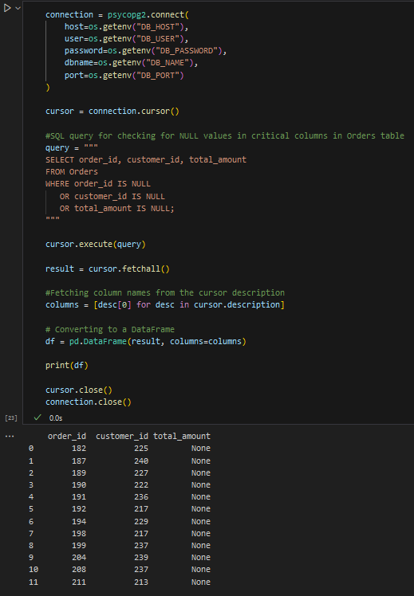

For identifying unusual values, I first computed the total_amount by summing the quantity and item_price columns, as the total_amount column contains many NULL values. Then, I calculated the average (avg_total) and standard deviation (stddev_total) of the computed total_amount. Any orders with a total_amount more than 2 standard deviations away from the average were flagged as unusually high or low. These flagged results were then displayed in the dataframe.

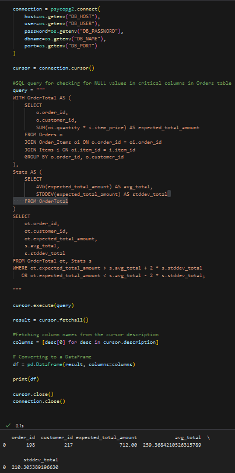

Finally we ensure all `order_id` in `Order_Items` exist in the `Orders` table (foreign key integrity) with a simple query which will return any order_id that doesnt have a correcponing entity in the orders table, ensuring integrity.

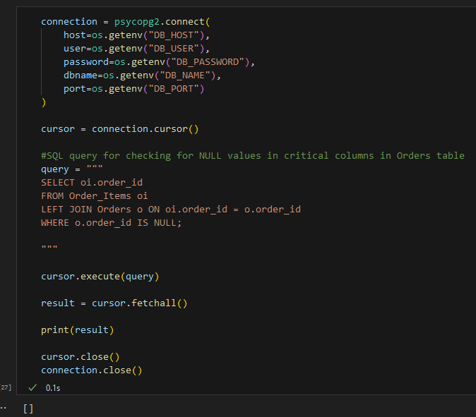

---

### 2. Troubleshooting Data Load Issues

Imagine a scenario where daily data loads are failing, and the new orders are not appearing
on the dashboard. Outline a step-by-step approach for diagnosing and resolving this issue.
Consider checkpoints in the ETL pipeline, database issues, and dashboard updates.

### Deliverable
- Write-up detailing your troubleshooting process and key checkpoints.

**Answer:**

To troubleshoot the missing daily data loads, I’d start by getting a clear picture of what’s going wrong. First, I’d check the ETL (Extract, Transform, Load) process and look through the logs for any recent changes, errors, or disruptions. I’d look for issues like changes to the ETL jobs, faulty filters, missing transformations, or failed job executions that could have caused the problem.

Next, I’d make sure the data being loaded is correct and complete. This means checking for any issues like NULL values, wrong data types, or strange special characters. If those checks aren’t already set up, I’d add filters to catch these types of errors early on in the process.

I’d also double-check that the database connection is set up properly. I want to make sure the pipeline is pointing to the right database and that there are no connection issues. Duplicate data or slow loading times are also important to look at, as they can point to problems with the ETL process or data transformations.

The database schema is another important area to check. If there have been any changes to the schema, like renamed columns or mismatched data types, this could break the data load. I’d confirm that the schema still matches what the ETL pipeline expects, and ensure everything is properly normalized.

Finally, I’d review the dashboard itself to make sure data is being displayed correctly. I’d check if there have been any changes to the data source connection, visualizations, or filters that might be causing new data to be left out.

To make future troubleshooting easier, I’d create a checklist of potential issues. This would help me quickly diagnose similar problems down the road and ensure that troubleshooting steps are well-documented for consistency.

